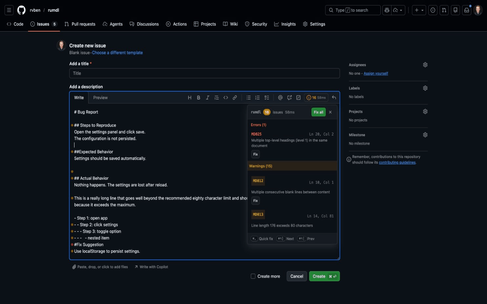
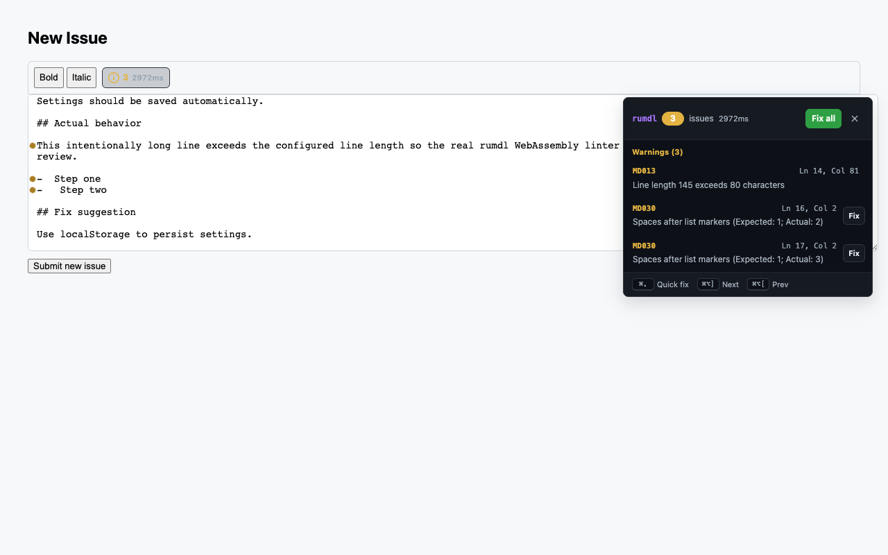
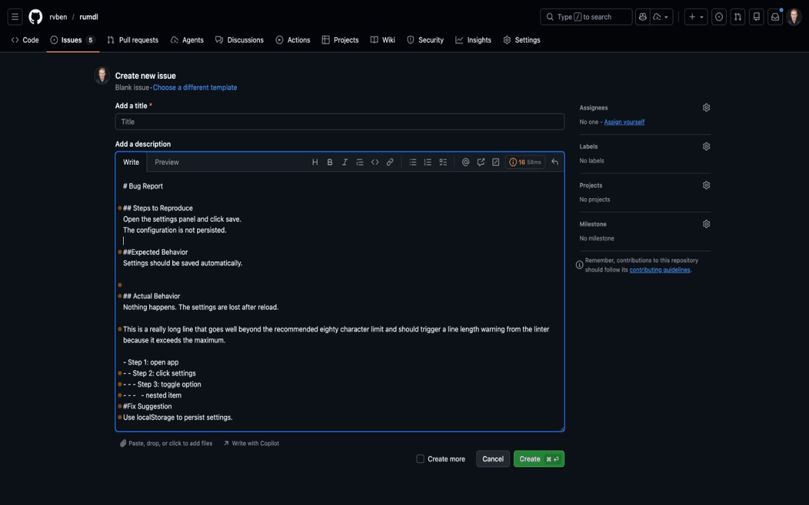
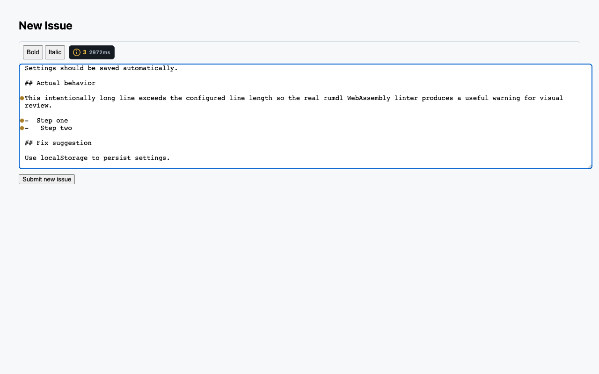
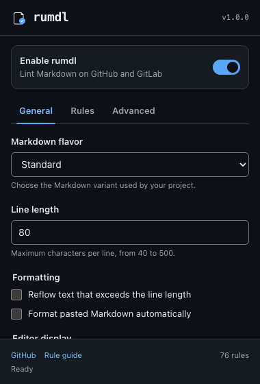
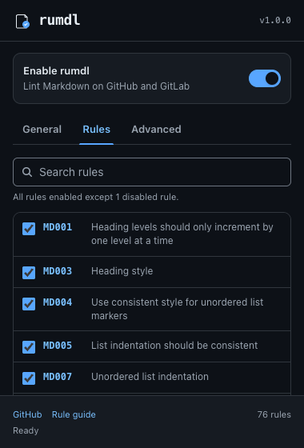

# rumdl Chrome Extension — Before/After Review

**Review completed:** 28 August 2026
**Scope:** popup, GitHub/GitLab editor integration, warning panel, gutter,
configuration, accessibility, responsive behavior, and release verification.

## Outcome

The extension moved from a functional but fragile interface to a coherent,
keyboard-operable product surface. The final pass was tested as a real unpacked
Chrome extension, not as static HTML: Chromium loaded the service worker,
content script, WebAssembly linter, popup, and `chrome.storage` integration.

| Quality area | Before | After |
|---|---:|---:|
| Visual hierarchy | 6/10 | 9/10 |
| Product consistency | 5/10 | 9/10 |
| Accessibility | 4/10 | 9/10 |
| Behavioral feedback | 5/10 | 10/10 |
| Responsive resilience | 4/10 | 9/10 |
| **Review score** | **24/50** | **46/50** |

The remaining four points are refinement headroom, not unresolved critical
issues. No P1 visual or interaction issue found in the final pass remains open.

## Visual comparison

### Warning panel

| Before | After |
|---|---|
|  |  |

The panel now uses scoped design tokens, consistent spacing, responsive
viewport clamping, visible lint/fix/error states, restrained motion, and one
rumdl accent. It cannot intercept clicks or remain in the accessibility tree
after closing.

### Gutter markers

| Before | After |
|---|---|
|  |  |

Markers are now native buttons with meaningful labels, focus rings, keyboard
activation, and Escape behavior. Their small visual footprint still respects
the host editor.

### Popup after states

| General | Rules |
|---|---|
|  |  |

The popup now has a shared light/dark token system, correct tab semantics and
arrow-key navigation, truthful loading/error/empty states, rule search,
expert-only raw rule controls, strict line-length validation, platform-aware
shortcut labels, and queued Saving/Saved/Error feedback.

## Behavioral before/after

| Experience | Before | After |
|---|---|---|
| Closed warning panel | Transparent overlay could remain interactive | `hidden`, inert, removed from hit-testing and accessibility tree |
| Warning navigation | Mouse-oriented rows | Native buttons, keyboard activation, current-item state |
| Focus | Close behavior could lose context | Returns to the control that opened the panel |
| Panel geometry | Fixed overlay could leave the viewport | Clamped on open, resize, and capture-phase scroll; responsive at 320px |
| Gutter | Color/hover-dependent dots | Labelled focusable controls with keyboard tooltip access |
| Popup tabs | Styled buttons only | Complete ARIA tab pattern with Arrow/Home/End keys |
| Rules | Competing raw lists and checkbox state | Searchable effective state; raw lists disclosed as Expert controls |
| Saving | Mostly silent | Queued Saving, Saved, failure, and Retry states |
| Lint/fix errors | Could fail silently or leave stale UI | Visible progress, stale-source, success, and recoverable error feedback |
| Settings updates | Reload-dependent | Active GitHub/GitLab editors update immediately |
| Fix safety | Async result could overwrite newer typing | Applies only when source content is unchanged |
| Host styling | Generic variables could leak | All injected tokens are scoped and prefixed `--rumdl-*` |
| Motion | Always animated | Reduced-motion preferences remove nonessential motion |

## Real-extension verification

| Check | Result |
|---|---:|
| TypeScript typecheck | Passed |
| Unit tests | **235/235 passed** across 13 files |
| Unpacked-extension Chromium tests | **7/7 passed** |
| GitHub and GitLab editor detection | Passed |
| Real WebAssembly lint results | Passed |
| Keyboard panel operation and focus restoration | Passed |
| Hidden-panel hit-testing and inert state | Passed |
| 320×480 responsive panel bounds | Passed |
| Popup tabs, search, validation, storage save | Passed |
| Live enable and gutter setting updates | Passed |
| Production build | Passed |
| Dependency audit | 0 known vulnerabilities |

The screenshot workflow also launches the unpacked extension and captures the
real editor and popup states. Run `npm run screenshots`; add
`SCREENSHOT_PREFIX=after-` to preserve an earlier baseline.

## Release assessment

The extension is ready for release review. The high-risk interaction defects
from the initial audit are resolved and guarded by browser tests. Future work
can focus on optional refinement—such as richer onboarding or host-specific
docking—without blocking this quality bar.
